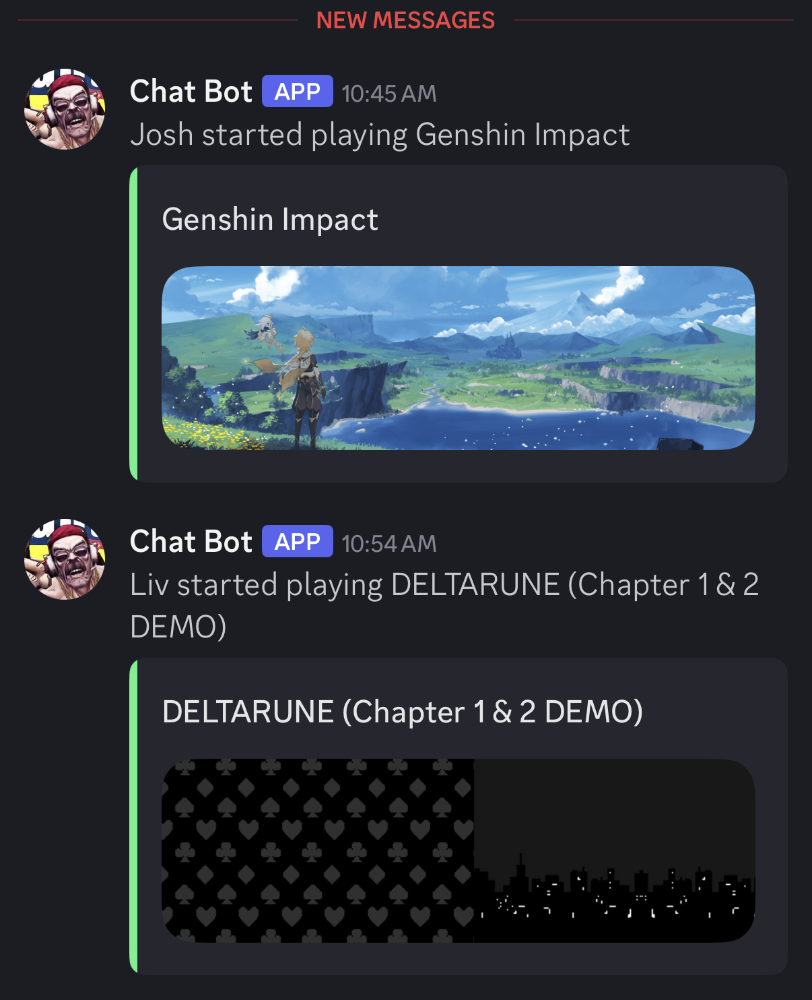

# 🔔 Notifications & Weekly Summaries (Node-RED)

If you use [Node-RED](https://nodered.org/) in Home Assistant, you can build incredibly powerful automations around your Gaming Status sensors. 

Below is a complete, copy-pasteable Node-RED flow that handles two advanced features:
1. **Real-time Discord Alerts:** Sends rich embedded messages to Discord when a player starts or finishes a game (including playtime duration and cover art).

2. **Weekly Playtime Summary:** Every Monday at 9:00 AM, it calculates the total hours played by everyone over the last week, generates a clean Markdown leaderboard, sends a mobile push notification, and displays it dynamically on your dashboard!

---

## 🛠️ Prerequisites

Before importing the flow, ensure you have the following ready:
* **The Node-RED Add-on** installed in Home Assistant.
* **A Discord Notification setup** in Home Assistant (or simply swap the Discord nodes out for standard mobile app notifications).
* **An Input Boolean:** You must create a helper toggle in Home Assistant called `input_boolean.gaming_report_visible`. The weekly flow turns this on to make the dashboard card visible.
* **External Access:** Discord requires external URLs to display images. You must know your external Home Assistant URL (e.g., Nabu Casa or a custom domain).

---

## 📥 1. The Node-RED Flow

Copy the entire JSON block below. In Node-RED, click the hamburger menu (top right) ➔ **Import** ➔ paste the JSON ➔ click **Import**.

~~~json
[{"id":"e1b69398a68fe154","type":"inject","z":"b6eb9f8533776a37","name":"Monday 9:00 AM","props":[{"p":"payload"},{"p":"topic","vt":"str"}],"repeat":"","crontab":"00 09 * * 1","once":false,"onceDelay":0.1,"topic":"","payload":"","payloadType":"date","x":170,"y":320,"wires":[["6a97ed8133692063"]]},{"id":"6a97ed8133692063","type":"ha-get-entities","z":"b6eb9f8533776a37","name":"Get Gaming Status","server":"ffd06ecd.ecb89","version":1,"rules":[{"condition":"state_object","property":"entity_id","logic":"is","value":"sensor.*_gaming_status","valueType":"re"}],"outputType":"array","outputEmptyResults":false,"outputLocationType":"msg","outputLocation":"payload","outputResultsCount":1,"x":390,"y":320,"wires":[["0fb519501502f5aa"]]},{"id":"0fb519501502f5aa","type":"function","z":"b6eb9f8533776a37","name":"Format Logic (Markdown)","func":"// --- CONFIGURATION ---\nconst CLICK_URL = \"/lovelace/gaming\";\n\n// --- DATE CALCULATION (Last Week: Sun-Sat) ---\nconst today = new Date();\n// Calculate last Saturday (End of the target week)\nconst endDate = new Date(today);\nendDate.setDate(today.getDate() - (today.getDay() + 1)); \n// Calculate the Sunday before that (Start of the target week)\nconst startDate = new Date(endDate);\nstartDate.setDate(endDate.getDate() - 6); \n\nconst dateOptions = { month: 'short', day: 'numeric' };\nconst dateRange = `${startDate.toLocaleDateString('en-US', dateOptions)} - ${endDate.toLocaleDateString('en-US', dateOptions)}`;\n\n// --- DATA PROCESSING ---\nconst entities = msg.payload; \nlet players = [];\nlet total_group_hours = 0;\n\nfunction formatTime(decimalHours) {\n    if (decimalHours === 0) return \"0h\";\n    let hrs = Math.floor(decimalHours);\n    let mins = Math.round((decimalHours - hrs) * 60);\n    if (hrs > 0 && mins > 0) return `${hrs}h ${mins}m`;\n    if (hrs > 0) return `${hrs}h`;\n    return `${mins}m`;\n}\n\nentities.forEach(entity => {\n    if (entity.entity_id.includes(\"_gaming_status\")) {\n        let attrs = entity.attributes;\n        let name = attrs.friendly_name.replace(\" Gaming Status\", \"\");\n        \n        // Master Sensor provides this value pre-calculated in hours\n        let hours = parseFloat(attrs.total_weekly_hours_last_week || 0);\n\n        // Use 'last_played_game' because 'current_game' might be null if they aren't playing right now\n        let game = attrs.last_played_game || \"None\";\n        \n        if (game.length > 25) game = game.substring(0, 25) + \"...\";\n        \n        if (hours > 0) {\n            players.push({ name: name, hours: hours, game: game });\n            total_group_hours += hours;\n        }\n    }\n});\n\nif (players.length === 0) return null;\nplayers.sort((a, b) => b.hours - a.hours);\n\n// --- OUTPUT GENERATION ---\n\n// 1. Mobile Notification\nlet mobile_msg = `${players.length} active players (${total_group_hours.toFixed(1)}h total).\\nTap for details.`;\n\n// 2. MARKDOWN REPORT\nlet report_msg = `**${dateRange}**\\n\\n`;\nreport_msg += `| Player | Time | Recent Activity |\\n`;\nreport_msg += `| :--- | :---: | :--- |\\n`;\n\nplayers.forEach((p) => {\n    let timeStr = formatTime(p.hours);\n    report_msg += `| **${p.name}** | ${timeStr} | ${p.game} |\\n`;\n});\n\n// --- PAYLOADS ---\n\nvar msg1 = {\n    payload: {\n        data: {\n            title: \"Weekly Report Ready\",\n            message: mobile_msg,\n            data: {\n                tag: \"gaming_report\",\n                color: \"#4CAF50\",\n                clickAction: CLICK_URL,\n                url: CLICK_URL\n            }\n        }\n    }\n};\n\nvar msg2 = {\n    report_text: report_msg\n};\n\nvar msg3 = {\n    payload: {\n        data: {\n            entity_id: \"input_boolean.gaming_report_visible\"\n        }\n    }\n};\n\nreturn [msg1, msg2, msg3];","outputs":3,"timeout":"","noerr":0,"initialize":"","finalize":"","libs":[],"x":630,"y":320,"wires":[["298d909daff3df1d"],["024ce27cb0b29e5a"],["05430dcdedc1c7ea"]]},{"id":"024ce27cb0b29e5a","type":"ha-api","z":"b6eb9f8533776a37","name":"Update Sensor","server":"ffd06ecd.ecb89","version":1,"debugenabled":false,"protocol":"http","method":"post","path":"/api/states/sensor.gaming_report_display","data":"{\t   \"state\": \"Ready\",\t   \"attributes\": {\t       \"report_text\": report_text,\t       \"friendly_name\": \"Gaming Report Content\",\t       \"icon\": \"mdi:chart-bar\"\t   }\t}","dataType":"jsonata","responseType":"json","outputProperties":[{"property":"payload","propertyType":"msg","value":"","valueType":"results"}],"x":900,"y":360,"wires":[[]]},{"id":"05430dcdedc1c7ea","type":"api-call-service","z":"b6eb9f8533776a37","name":"Show Card","server":"ffd06ecd.ecb89","version":7,"debugenabled":false,"action":"input_boolean.turn_on","floorId":[],"areaId":[],"deviceId":[],"entityId":[],"labelId":[],"data":"{\"entity_id\":\"input_boolean.gaming_report_visible\"}","dataType":"json","mergeContext":"","mustacheAltTags":false,"outputProperties":[],"queue":"none","blockInputOverrides":false,"domain":"input_boolean","service":"turn_on","x":890,"y":420,"wires":[[]]},{"id":"298d909daff3df1d","type":"api-call-service","z":"b6eb9f8533776a37","name":"Notify Mobile","server":"ffd06ecd.ecb89","version":7,"debugenabled":false,"action":"notify.mobile_app_your_device","floorId":[],"areaId":[],"deviceId":[],"entityId":[],"labelId":[],"data":"","dataType":"json","mergeContext":"","mustacheAltTags":false,"outputProperties":[],"queue":"none","blockInputOverrides":false,"domain":"notify","service":"mobile_app_your_device","x":890,"y":300,"wires":[[]]},{"id":"9fa749e12b08a453","type":"server-state-changed","z":"b6eb9f8533776a37","name":"Master Gaming Status","server":"ffd06ecd.ecb89","version":6,"outputs":1,"exposeAsEntityConfig":"","entities":{"entity":[],"substring":[],"regex":["^sensor\\..*_gaming_status$"]},"outputInitially":false,"stateType":"str","ifState":"","ifStateType":"str","ifStateOperator":"is","outputOnlyOnStateChange":true,"for":"0","forType":"num","forUnits":"seconds","ignorePrevStateNull":true,"ignorePrevStateUnknown":true,"ignorePrevStateUnavailable":true,"ignoreCurrentStateUnknown":true,"ignoreCurrentStateUnavailable":true,"outputProperties":[{"property":"payload","propertyType":"msg","value":"string","valueType":"entityState"},{"property":"data","propertyType":"msg","value":"","valueType":"eventData"},{"property":"topic","propertyType":"msg","value":"","valueType":"triggerId"}],"x":160,"y":60,"wires":[["1ddbfbdb0b515a69"]]},{"id":"1ddbfbdb0b515a69","type":"switch","z":"b6eb9f8533776a37","name":"Only Status Changes","property":"data.old_state.state","propertyType":"msg","rules":[{"t":"neq","v":"data.new_state.state","vt":"msg"}],"checkall":"true","repair":false,"outputs":1,"x":380,"y":60,"wires":[["6a94fbaa157968b5"]]},{"id":"6a94fbaa157968b5","type":"delay","z":"b6eb9f8533776a37","name":"Delay","pauseType":"delay","timeout":"30","timeoutUnits":"seconds","rate":"1","nbRateUnits":"1","rateUnits":"second","randomFirst":"1","randomLast":"5","randomUnits":"seconds","drop":false,"allowrate":false,"outputs":1,"x":550,"y":60,"wires":[["15b0c80c53aa45bf"]]},{"id":"15b0c80c53aa45bf","type":"api-current-state","z":"b6eb9f8533776a37","name":"Get Full Attributes","server":"ffd06ecd.ecb89","version":3,"outputs":1,"halt_if":"","halt_if_type":"str","halt_if_compare":"is","entity_id":"{{topic}}","state_type":"str","blockInputOverrides":true,"outputProperties":[{"property":"payload","propertyType":"msg","value":"","valueType":"entity"},{"property":"data","propertyType":"msg","value":"","valueType":"entity"}],"for":"0","forType":"num","forUnits":"minutes","override_topic":false,"state_location":"payload","override_payload":"msg","entity_location":"data","override_data":"msg","x":710,"y":60,"wires":[["717de6cabf9eb1e3"]]},{"id":"717de6cabf9eb1e3","type":"function","z":"b6eb9f8533776a37","name":"Process & Deduplicate","func":"const entity = msg.data;\nconst gameState = entity.state;\nconst attributes = entity.attributes;\nconst flowContextKey = `last_notified_${entity.entity_id}`;\nconst offlineTimeKey = `last_offline_time_${entity.entity_id}`;\nconst lastGameNameKey = `prev_game_name_${entity.entity_id}`;\n\n// 1. HANDLE OFFLINE RESET\nif (gameState === \"Offline\") {\n    const lastGame = flow.get(flowContextKey);\n    if (lastGame) {\n        flow.set(lastGameNameKey, lastGame);\n    }\n    flow.set(flowContextKey, null);\n    flow.set(offlineTimeKey, Date.now());\n    return null;\n}\n\n// 2. SMART ANTI-FLAP CHECK\nconst lastOfflineTime = flow.get(offlineTimeKey) || 0;\nconst timeSinceOffline = Date.now() - lastOfflineTime;\n\n// Helper: Title Case\nfunction toTitleCase(str) {\n    return str.replace(/\\w\\S*/g, function (txt) {\n        return txt.charAt(0).toUpperCase() + txt.substr(1).toLowerCase();\n    });\n}\n\n// Determine display name (Fix casing if incoming is all lowercase)\nlet displayGame = gameState;\nif (gameState === gameState.toLowerCase() && gameState !== gameState.toUpperCase()) {\n    displayGame = toTitleCase(gameState);\n}\n\nif (timeSinceOffline < 30000) {\n    const previousGame = flow.get(lastGameNameKey);\n    // BLOCK if it's the exact same game re-appearing (Ghost notification)\n    if (previousGame === displayGame) {\n        return null; \n    }\n}\n\n// 3. FILTER INVALID STATES\nconst invalidStates = [\"Online\", \"unavailable\", \"unknown\", \"idle\"];\nif (!gameState || invalidStates.includes(gameState)) {\n    return null;\n}\n\n// 4. GET PLATFORM & NAME\nlet platform = attributes.active_platform || \"Gaming\";\nif (platform === \"Playstation\") {\n    platform = \"PlayStation\";\n}\n\nlet friendyName = attributes.friendly_name || \"Someone\";\nfriendyName = friendyName.replace(\" Gaming Status\", \"\").trim();\n\n// 5. IMAGE HANDLING (Update with your URL)\nlet imageUrl = attributes.game_cover_art || attributes.entity_picture || \"\";\nif (imageUrl && imageUrl.startsWith('/')) {\n    const baseUrl = \"https://your-home-assistant-url.com\"; // <-- UPDATE THIS\n    imageUrl = `${baseUrl}${imageUrl}`;\n}\n\n// 6. DEDUPLICATION (Standard Check)\nconst lastNotifiedGame = flow.get(flowContextKey);\n\nif (lastNotifiedGame === displayGame) {\n    return null; \n}\n\n// Save this as the current active game\nflow.set(flowContextKey, displayGame);\n\n// 7. OUTPUT\nmsg.title = platform;\nmsg.friendlyName = friendyName;\nmsg.game = displayGame;\nmsg.image = imageUrl;\n\nreturn msg;","outputs":1,"timeout":0,"noerr":0,"initialize":"","finalize":"","libs":[],"x":920,"y":60,"wires":[["8de282ec4076fcda"]]},{"id":"8de282ec4076fcda","type":"switch","z":"b6eb9f8533776a37","name":"Route by Person","property":"data.entity_id","propertyType":"msg","rules":[{"t":"regex","v":"player_one|player_two","vt":"str","case":true},{"t":"regex","v":"player_three|player_four","vt":"str","case":true}],"checkall":"true","repair":false,"outputs":2,"x":910,"y":120,"wires":[["7bb79d4dcc7f83b6"],["f7285dd733bcfa86"]]},{"id":"7bb79d4dcc7f83b6","type":"api-call-service","z":"b6eb9f8533776a37","name":"Discord Server","server":"ffd06ecd.ecb89","version":7,"debugenabled":false,"action":"notify.chat_bot","floorId":[],"areaId":[],"deviceId":[],"entityId":[],"labelId":[],"data":"{\t   \"message\": friendlyName & \" started playing \" & game,\t   \"target\": \"YOUR_DISCORD_CHANNEL_ID\",\t   \"data\": {\t       \"embed\": {\t           \"title\": game,\t           \"color\": 5763719,\t           \"image\": {\t               \"url\": image\t           }\t       }\t   }\t}","dataType":"jsonata","mergeContext":"","mustacheAltTags":false,"outputProperties":[],"queue":"none","blockInputOverrides":false,"domain":"notify","service":"chat_bot","x":1200,"y":60,"wires":[[]]},{"id":"f7285dd733bcfa86","type":"api-call-service","z":"b6eb9f8533776a37","name":"Discord DM","server":"ffd06ecd.ecb89","version":7,"debugenabled":false,"action":"notify.chat_bot","floorId":[],"areaId":[],"deviceId":[],"entityId":[],"labelId":[],"data":"{\t   \"message\": friendlyName & \" started playing \" & game,\t   \"target\": \"YOUR_DISCORD_USER_ID\",\t   \"data\": {\t       \"embed\": {\t           \"title\": game,\t           \"color\": 5763719,\t           \"image\": {\t               \"url\": image\t           }\t       }\t   }\t}","dataType":"jsonata","mergeContext":"","mustacheAltTags":false,"outputProperties":[],"queue":"none","blockInputOverrides":false,"domain":"notify","service":"chat_bot","x":1190,"y":120,"wires":[[]]},{"id":"ed725f52c0fe4ae4","type":"server-state-changed","z":"b6eb9f8533776a37","name":"Gaming Status Change","server":"ffd06ecd.ecb89","version":6,"outputs":1,"exposeAsEntityConfig":"","entities":{"entity":[],"substring":[],"regex":["^sensor\\..*_gaming_status$"]},"outputInitially":false,"stateType":"str","ifState":"","ifStateType":"str","ifStateOperator":"is","outputOnlyOnStateChange":true,"for":"0","forType":"num","forUnits":"seconds","ignorePrevStateNull":true,"ignorePrevStateUnknown":true,"ignorePrevStateUnavailable":false,"ignoreCurrentStateUnknown":true,"ignoreCurrentStateUnavailable":false,"outputProperties":[{"property":"payload","propertyType":"msg","value":"","valueType":"entityState"},{"property":"data","propertyType":"msg","value":"","valueType":"eventData"},{"property":"topic","propertyType":"msg","value":"","valueType":"triggerId"}],"x":160,"y":200,"wires":[["a2ec27b6e125b3d6"]]},{"id":"a2ec27b6e125b3d6","type":"function","z":"b6eb9f8533776a37","name":"Calculate Duration","func":"// --- CONFIGURATION ---\nconst MIN_DURATION_SEC = 60; // 1 minute minimum\n\n// --- INPUTS ---\nconst entityId = msg.topic;\nconst newState = msg.data.new_state ? msg.data.new_state.state : \"unknown\";\nconst oldState = msg.data.old_state ? msg.data.old_state.state : \"unknown\";\nconst attributes = msg.data.new_state.attributes || {};\n\n// --- IGNORE LIST ---\nconst IGNORED_APPS = [\"online\", \"home\", \"xbox app\", \"youtube\", \"netflix\", \"hulu\", \"spotify\", \"twitch\", \"crunchyroll\", \"unknown\", \"unavailable\", \"idle\", \"offline\", \"none\", \"\"];\n\n// --- MEMORY KEYS ---\nconst timeKey = `start_time_${entityId}`;\nconst gameKey = `last_game_${entityId}`;\nconst imageKey = `last_image_${entityId}`;\n\n// --- HELPER: FORMAT TIME ---\nfunction formatDuration(seconds) {\n    let hrs = Math.floor(seconds / 3600);\n    let mins = Math.floor((seconds % 3600) / 60);\n    if (hrs > 0) return `${hrs}h ${mins}m`;\n    return `${mins}m`;\n}\n\n// --- LOGIC ---\n\n// 1. GAME STARTED\nif (!IGNORED_APPS.includes(newState.toLowerCase())) {\n    // Save Start Time and Game Details\n    flow.set(timeKey, Date.now());\n    flow.set(gameKey, newState);\n    \n    // Handle Image URL (Update with your URL)\n    let imageUrl = attributes.game_cover_art || attributes.entity_picture || \"\";\n    if (imageUrl && imageUrl.startsWith('/')) {\n        imageUrl = `https://your-home-assistant-url.com${imageUrl}`; // <-- UPDATE THIS\n    }\n    flow.set(imageKey, imageUrl);\n    \n    return null;\n}\n\n// 2. GAME ENDED\nif (IGNORED_APPS.includes(newState.toLowerCase()) && !IGNORED_APPS.includes(oldState.toLowerCase())) {\n    \n    const startTime = flow.get(timeKey);\n    const lastGame = flow.get(gameKey);\n    const lastImage = flow.get(imageKey);\n\n    // Clear Memory\n    flow.set(timeKey, null);\n    flow.set(gameKey, null);\n    flow.set(imageKey, null);\n\n    if (!startTime || !lastGame) return null;\n\n    // Calculate Duration\n    const durationSec = (Date.now() - startTime) / 1000;\n    if (durationSec < MIN_DURATION_SEC) return null;\n\n    let platform = attributes.active_platform || \"Gaming\";\n    if (platform === \"Playstation\") {\n        platform = \"PlayStation\";\n    }\n\n    // Prepare Output\n    msg.title = platform;\n    msg.friendlyName = (attributes.friendly_name || \"Someone\").replace(\" Gaming Status\", \"\").trim();\n    msg.game = lastGame;\n    msg.duration = formatDuration(durationSec);\n    msg.image = lastImage;\n    \n    return msg;\n}\n\nreturn null;","outputs":1,"timeout":"","noerr":0,"initialize":"","finalize":"","libs":[],"x":410,"y":200,"wires":[["18ca4f405156cd71"]]},{"id":"18ca4f405156cd71","type":"switch","z":"b6eb9f8533776a37","name":"Route by Person","property":"topic","propertyType":"msg","rules":[{"t":"regex","v":"player_one|player_two","vt":"str","case":true},{"t":"regex","v":"player_three|player_four","vt":"str","case":true}],"checkall":"true","repair":false,"outputs":2,"x":670,"y":200,"wires":[["c94deb760a5f6d77"],["b835a2c88c85060e"]]},{"id":"c94deb760a5f6d77","type":"api-call-service","z":"b6eb9f8533776a37","name":"Discord Server","server":"ffd06ecd.ecb89","version":7,"debugenabled":false,"action":"notify.chat_bot","floorId":[],"areaId":[],"deviceId":[],"entityId":[],"labelId":[],"data":"{\t   \"message\": friendlyName & \" finished playing \" & game,\t   \"target\": \"YOUR_DISCORD_CHANNEL_ID\",\t   \"data\": {\t       \"embed\": {\t           \"title\": game,\t           \"description\": \"Duration: \" & duration,\t           \"color\": 15158332,\t           \"image\": {\t               \"url\": image\t           }\t       }\t   }\t}","dataType":"jsonata","mergeContext":"","mustacheAltTags":false,"outputProperties":[],"queue":"none","blockInputOverrides":false,"domain":"notify","service":"chat_bot","x":900,"y":180,"wires":[[]]},{"id":"b835a2c88c85060e","type":"api-call-service","z":"b6eb9f8533776a37","name":"Discord DM","server":"ffd06ecd.ecb89","version":7,"debugenabled":false,"action":"notify.chat_bot","floorId":[],"areaId":[],"deviceId":[],"entityId":[],"labelId":[],"data":"{\t   \"message\": friendlyName & \" finished playing \" & game,\t   \"target\": \"YOUR_DISCORD_USER_ID\",\t   \"data\": {\t       \"embed\": {\t           \"title\": game,\t           \"description\": \"Duration: \" & duration,\t           \"color\": 15158332,\t           \"image\": {\t               \"url\": image\t           }\t       }\t   }\t}","dataType":"jsonata","mergeContext":"","mustacheAltTags":false,"outputProperties":[],"queue":"none","blockInputOverrides":false,"domain":"notify","service":"chat_bot","x":890,"y":240,"wires":[[]]},{"id":"ffd06ecd.ecb89","type":"server","name":"Home Assistant","addon":true,"rejectUnauthorizedCerts":true,"ha_boolean":"","connectionDelay":false,"cacheJson":false,"heartbeat":false,"heartbeatInterval":"30","statusSeparator":"","enableGlobalContextStore":false}]
~~~

### 📝 What You Need to Change
After importing, you will need to update a few details to match your specific setup:

1. **Update the External Image URLs:** Open the two large `function` nodes ("Process & Deduplicate" and "Calculate Duration"). Find the line that says `const baseUrl = "https://your-home-assistant-url.com";` and change it to your actual remote Home Assistant URL. *(Discord cannot load local `192.168.x.x` images).*
2. **Configure the Routing Switch:** Open the two yellow "Route by Person" nodes. This uses simple Regex logic (`player_one|player_two`) to look at the entity ID and route the notification path. Change these names to match your household. For example, if you want your kids' notifications to go to a public Discord channel, and your own to go to a private DM, list the names accordingly.
3. **Set Discord Targets:** Open the green Discord notification nodes at the end of the flow. Update the `"target"` field to point to your specific Discord Channel ID or User ID.
4. **Mobile App Device:** Open the green "Notify Mobile" node in the Weekly flow and select your specific phone entity from the dropdown.

---

## 📊 2. How the Weekly Summary Works
The weekly flow does something incredibly clever: rather than relying on YAML configuration files, it uses the Home Assistant API (`/api/states/sensor.gaming_report_display`) to **create a sensor out of thin air.** When the flow runs on Monday morning, it compiles the Markdown text and injects it straight into Home Assistant as `sensor.gaming_report_display`. Because this sensor isn't hardcoded into your YAML, it vanishes gracefully if Home Assistant restarts, keeping your system clean.

### The Dashboard Card
Add the YAML code below to your Lovelace dashboard. 

* **Behavior:** This card is completely invisible all week. When Monday morning hits, the Node-RED flow turns on `input_boolean.gaming_report_visible`. The card instantly appears on your dashboard, displaying the beautifully formatted markdown leaderboard. 
* **Dismissing:** When you are done reading it, simply click the "X" (close icon) in the header. This toggles the boolean off and hides the card until next Monday!

~~~yaml
type: grid
cards:
  - type: heading
    heading: Weekly Summary
    heading_style: title
    icon: mdi:calendar
    badges:
      # Close button that hides the card
      - type: entity
        show_state: false
        show_icon: true
        entity: input_boolean.gaming_report_visible
        icon: mdi:close
        tap_action:
          action: call-service
          service: input_boolean.turn_off
          target:
            entity_id: input_boolean.gaming_report_visible
  - type: entities
    show_header_toggle: false
    entities:
      # Pulls the Markdown text generated by Node-RED
      - type: custom:hui-element
        card_type: markdown
        content: "{{ state_attr('sensor.gaming_report_display', 'report_text') }}"
        card_mod:
          style:
            .: |
              ha-card {
                box-shadow: none;
                border: none;
                background: none;
                padding: 0px;
              }
            ha-markdown $: |
              ha-markdown-element p {
                font-size: 1.5em;       
                font-weight: 800;
                margin-bottom: 8px;
                margin-left: 0px;
                margin-top: 0px;
              }  
              ha-markdown-element table {
                border: none;
                border-collapse: separate; 
                border-spacing: 0; 
                width: 100%;
              }
              ha-markdown-element th {
                border: none;
                border-bottom: none;
                opacity: 0.7;
                padding: 10px;
                background-color: white;
                color: black;
              }
              ha-markdown-element th:first-child {
                border-top-left-radius: 5px;
                border-bottom-left-radius: 5px;
              }
              ha-markdown-element th:last-child {
                border-top-right-radius: 5px;
                border-bottom-right-radius: 5px;
              }
              ha-markdown-element td {
                border: none;
                border-bottom: none;
                padding: 10px;
                text-align: left;
              }
    grid_options:
      columns: full
      rows: auto
column_span: 2
# Keeps the card hidden unless the Node-RED flow turns it on
visibility:
  - condition: state
    entity: input_boolean.gaming_report_visible
    state: "on"
~~~