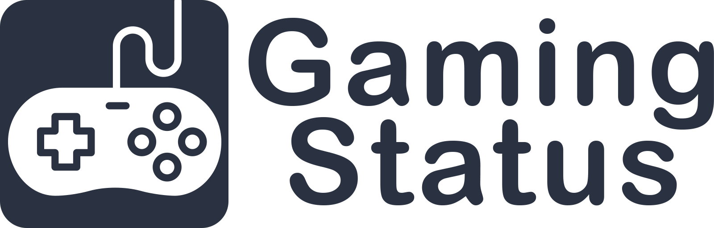

# 🎮 Gaming Status for Home Assistant

This is a powerful, unified custom integration for Home Assistant that tracks and consolidates gaming presence across Steam, Xbox Live, PlayStation Network, and custom PC clients into a single, clean dashboard sensor for each person in your household. It's super useful if you want to be able to track who is online, what they're playing, and for how long. 

I started developing this as a way to have persistent sensors since I was annoyed that the Xbox and Steam sesnors would regularly flutter between online/offline status, making notifications and my gaming dashboard unreliable. This evolved into making master sensors instead of simply tracking each platform independently. Over time, this has grown into a much more complex integration that now tracks game time, last game played, provides cover art, allows for rich notifications through Discord and much, much more.

Some of the key features are listed below.

## ✨ Features
* **Unified Master Sensor:** Combines Xbox, PlayStation, Steam, and Custom PC clients into one clean "Master Status" sensor per person.
* **Custom PC Game Support:** Track non-platform games (like Epic Games, Minecraft, or Genshin Impact) using template funnels or binary sensors.
* **Smart Ghosting Protection:** Automatically prevents echo sessions (e.g., when the Windows Xbox app incorrectly broadcasts a Steam game).
* **Drop-Out Protection:** Built-in grace periods prevent a gamer from appearing "Offline" if their game crashes, they switch titles, or their internet briefly blips, keeping play sessions perfectly intact.
* **Playtime Analytics:** Automatically calculates session time, daily hours, and a rolling 7-day total for easy dashboard charting.
* **Clean Dashboards:** Automatically sanitizes messy game titles (e.g., changes "Minecraft Launcher" to "Minecraft") and pulls high-quality cover art from SteamGridDB.
* **Advanced Exclusion Filtering:** Prevent media apps (Netflix, YouTube, Spotify) or background processes from triggering gaming statuses using a global exclusions list.
* **Zero-Bloat Cover Art:** Automatically fetches gorgeous, clean game hero images from SteamGridDB and passes them to your dashboard via URL, ensuring your local HA storage never gets bloated with downloaded images.
* **"Last Seen" Memory:** When gamers go offline, the sensor retains their last played game and calculates exactly how long ago they were active (e.g., *Last seen 3h ago: Genshin Impact (1h 37m)*).
* **Custom Avatars:** Automatically pulls live gamer pictures from platform APIs, with the option to easily override missing or incorrect images with your own local images.

## ⚠️ Prerequisites
This integration acts as a "wrapper" that intelligently processes data from your existing integrations. Before installing, ensure you have any necessary base integrations installed and working in Home Assistant:
* [Official PlayStation Network Integration](https://www.home-assistant.io/integrations/playstation_network)
* [Official Steam Integration](https://www.home-assistant.io/integrations/steam_online)
* [Official Xbox Integration](https://www.home-assistant.io/integrations/xbox)
* [SteamGridDB API Key](https://www.steamgriddb.com/) (for cover art)

## Recommended
While not required for functionality, I recommend installing the following HACS integrations for the most robust dashboard cards:
* [Mushroom Cards](https://github.com/piitaya/lovelace-mushroom) - For the beautiful base layouts
* [Card-Mod](https://github.com/thomasloven/lovelace-card-mod) - For the blurred backgrounds and borders
* [Auto-Entities](https://github.com/thomasloven/lovelace-auto-entities) - To automatically hide offline players
* [ApexCharts Card](https://github.com/RomRider/apexcharts-card) - For the stats graph
* [Custom Button-Card](https://github.com/custom-cards/button-card) - For the slideshow
* [HASS.Agent](https://www.hass-agent.io/2.2/getting-started/installation/#installing-hassagent) - Install both the PC app and the integration for Custom PC sensors

### Obtaining a SteamGridDB API Key
To display beautiful, high-resolution game covers on your dashboard, this integration requires a free API key from SteamGridDB.

1. Go to [SteamGridDB.com](https://www.steamgriddb.com/).
2. Click **Login** in the top right corner and authenticate using your Steam account.
3. Click your profile picture in the top right and select **Preferences**.
4. Navigate to the **API** tab on the left menu.
5. Click **Generate API Key**.
6. Copy the string of letters and numbers generated. 

## 📥 Installation

### HACS (Recommended)
1. Open HACS in Home Assistant.
2. Click the three dots in the top right corner and select **Custom repositories**.
3. Add the URL to this repository and select **Integration** as the category.
4. Click **Download**.
5. **Restart Home Assistant.**
6. Add the integration under Settings > Devices & Services and searching for **"Gaming Status"**

### Manual Installation
If you prefer not to use HACS, you can install the integration manually:

1. Download the latest release from the [GitHub Releases page](https://github.com/adamjthompson/Gaming-Status/releases). *(Note: Download the Source Code ZIP, not the main repository branch).*
2. Extract the downloaded ZIP file.
3. Locate the `custom_components/gaming_status/` folder inside the extracted files.
4. Copy that entire `gaming_status` folder into your Home Assistant `config/custom_components/` directory. *(If the `custom_components` folder does not exist, create it).*
5. **Restart Home Assistant.**
6. Add the integration under Settings > Devices & Services and searching for **"Gaming Status"**

##  Activating the Integration
Once your `gaming_profiles.json` file is configured and saved:
1. Go to **Settings** ➔ **Devices & Services** in Home Assistant.
2. Click **+ Add Integration**.
3. Search for **Gaming Status** and select it.
4. Input your **SteamGridDB API Key** when prompted.

## ⚙️ Configuration (Crucial Step)
Because every home setup is unique, this integration requires a manual configuration file to map your entities to the right gamer. All settings will be configured inside of `config/gaming_profiles.json`. 

Use the *Gaming Status Configurator* to easily generate the required JSON file. This will show up after installation as an entry on your sidebar labeled "Gaming Status". Further editing of [advanced options](docs/advanced.md) can be performed manually in VSCode or your editor of choice. **After adding your information, save the JSON file and either reload the integration or restart Home Assistant.**

*Additionally, there is a [`example.profiles.json`](custom_components/gaming_status/example.profiles.json) file provided that can be used as a starting point if you prefer to edit the file manually yourself. See the [Advanced Setup](docs/advanced.md) documentation for more details.*

### Entities

Upon reload (or restart), the integration will instantly read your `config/gaming_profiles.json` file and generate the master tracking sensors for your dashboard. Look for the new master sensors named `sensor.XXXXXXXX.gaming_status`. Additionally, individual platform sensors will be created ending in `_playstation`, `_steam`, `_xbox`, and `_custom`, where applicable.

| Entity | Type | Description |
| -------| ---- | ----------- |
| sensor.XXXXX_steam | Sensor | Steam sensor for each added profile |
| sensor.XXXXX_xbox | Sensor | Xbox sensor for each added profile |
| sensor.XXXXX_playstation | Sensor | PlayStation sensor for each added profile |
| sensor.XXXXX_gaming_status | Sensor | Master sensor for each added profile that combines all added platforms into one "Online/Offline" status |
| sensor.XXXXX_daily_gaming_hours_chart | Sensor | Daily game time, tracked in 0.0 h format |

### Attributes
Each sensor has a set of attributes that can be utilized in dashboards charts, etc. The `*_gaming_status` sensors provide the following attibutes
| Attribute | Description | Example Value |
| ----------| ----------- | ------------- |
| secondary | A human-readable string summarizing the current state, or the time elapsed and session duration of the last played game. | Last seen 12h ago: Marvel Rivals (58m) |
| active_platform | Specific console or launcher (e.g., Steam, Xbox, PlayStation) that is currently active or was most recently used. | Steam |
| game_cover_art | URL of the cover or header image for the currently active or last played game. | https://cdn2.steamgriddb.com/hero/a31d2779e08530d0b5fdbed368c735b4.png |
| last_played_game | Title of the most recent game detected across all tracked platforms. | Marvel Rivals |
| last_online_valid_timestamp | The exact ISO 8601 timestamp of the last moment the integration successfully detected the player online. | 2026-04-29T22:40:26.404703-04:00 |
| total_daily_hours | Total accumulated playtime in hours across all platforms for the current calendar day. | 1.0 |
| total_weekly_hours | Total accumulated playtime in hours across all platforms for the current calendar week. | 8.54 |
| rolling_weekly_hours | Total accumulated playtime in hours over a dynamic, trailing 7-day window. | 3.69 |
| total_weekly_hours_last_week | Final accumulated playtime in hours recorded during the previous calendar week. | 16.94 |
| entity_picture | URL of the player's profile avatar fetched from the currently active platform. | https://avatars.steamstatic.com/XXXXX_medium.jpg |
| icon | Icon that automatically updates to match the active platform. | mdi:steam |
| friendly_name | Display name generated for this player's entity.| Adam Gaming Status |

## What to Try Next!?
Once everything is up and running, with sensors showing up from the integration, try loading up a game to make sure the online status is reflected in the master "_gaming_status" sensors. If they are working correctly, try some of the following! If not, see the [troubleshooting](docs/troubleshooting.md) documentation.

- Add some sweet displays to your [dashboard](docs/dashboards.md#1-the-currently-playing-card), showing who's online and what they're playing
- Set up Discord or SMS [notifications](docs/notifications.md) for when users start and stop playing games
- Add a [graph](docs/dashboards.md#3-the-playtime-stats-chart) to chart weekly game time
- Add a [slideshow](docs/dashboards.md#2-cinematic-slideshow-with-player-avatars) to your wallpanel display to see what's being played
- Add [custom sensors](docs/advanced.md#tracking-standalone-pc-games-hassagent-setup) to track PC games not logged by Steam or Xbox
- Add a [sensor](docs/advanced.md#the-is-anyone-gaming-binary-sensor-for-automations) to track whether or not anyone is gaming (useful for automations or contextual card display)
- Check out other [advanced setup options](docs/advanced.md) for features like preventing tracking of games by the wrong players and per-user game exclusions
